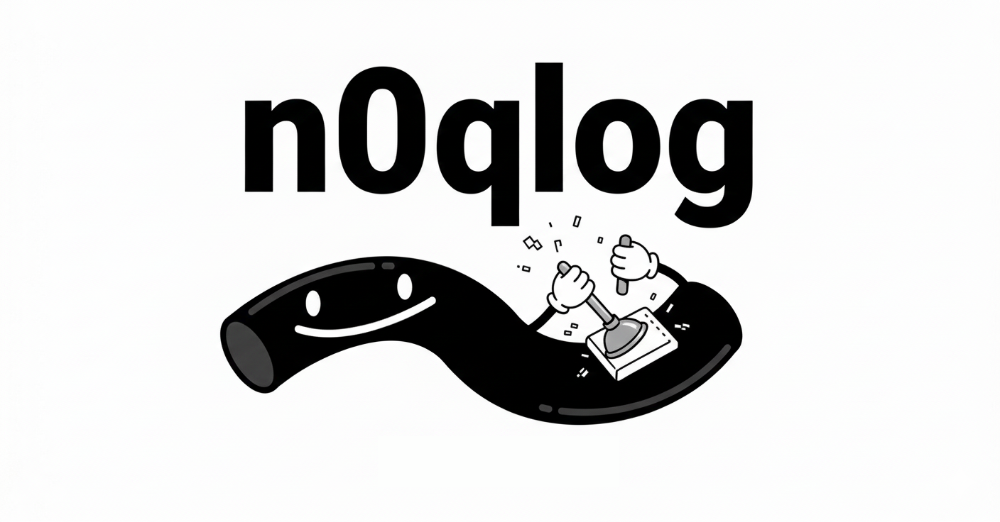

# n0qlog



A high-performance, native GUI application for viewing and analyzing QUIC [qlog](https://datatracker.ietf.org/doc/draft-ietf-quic-qlog-main-schema/) files.

Built with [egui](https://crates.io/crates/egui) and designed to be faster than web-based tools like qvis. Efficiently handles large qlog files.

## Installation

```
cargo install n0qlog
```

Or build from source:

```
cargo build --release
```

## Usage

### Running the Application

```
n0qlog
```

Or with cargo:

```
cargo run --release
```

### Loading Files

1. Click **File → Open...**
2. Select a `.qlog`, `.json`, or `.sqlog` file
3. Supports standard JSON, NDJSON, and RFC 7464 JSON-SEQ formats

### Views

Switch between views using the **View** menu:

- **Event List** - Browseable table of all events with filtering
- **Sequence Diagram** - Timeline showing packet exchanges between client/server
- **Congestion Graph** - RTT and congestion window metrics over time
- **Packetization Diagram** - Frame and packet boundary visualization

### Filtering

In Event List view, filter by:
- Event name (e.g., "packet_sent", "metrics")
- Stream ID
- Packet type (Initial, Handshake, 0-RTT, 1-RTT)

### Interactive Features

- **Zoom/Pan**: Scroll wheel to zoom, drag to pan
- **Click to Select**: Click events or packets to see details
- **Toggle Metrics**: Show/hide individual metrics in graphs

## Features

- Multi-format support (JSON, NDJSON, JSON-SEQ)
- SIMD-accelerated parsing with [sonic-rs](https://crates.io/crates/sonic-rs)
- Virtual scrolling for large event lists
- Interactive diagrams with zoom/pan
- Event detail panel with full JSON view

## License

Apache-2.0 OR MIT
